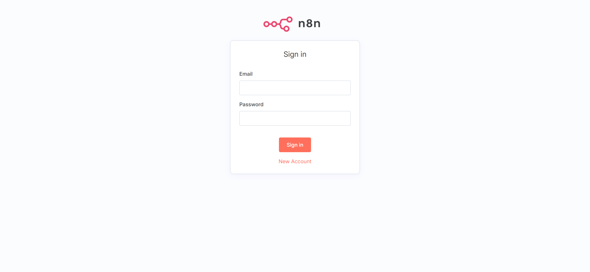
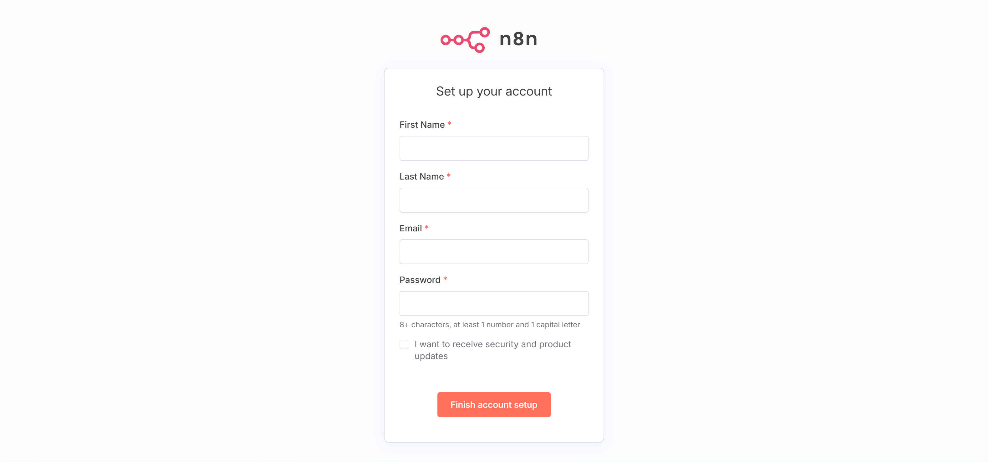

# N8N-Genie
An AI-powered plugin for n8n that enhances workflow automation with intelligent code generation, repository analysis, and conversational assistance capabilities.

## Demo
https://github.com/user-attachments/assets/95540bb3-47f5-4ad5-b6ff-70a1f2de9a7d


## Features
### 1. AI-Powered Workflow Creation
- **Natural Language to n8n Workflow**: Transform user descriptions into complete n8n workflow JSON configurations
- **Intelligent Node Selection**: Automatically selects and configures appropriate n8n nodes based on workflow requirements
- **Smart Parameter Configuration**: AI determines optimal settings for each node in the workflow

### 2. Workflow Modification Assistant
- **Conversational Workflow Editing**: Modify existing workflows through natural language instructions
- **Intelligent Updates**: Add, remove, or modify nodes and connections based on user requests
- **Preserve Workflow Integrity**: Maintains existing workflow structure while applying requested changes

## Install 
**Step 1: Git Clone & Install Python Packages**
```
git clone https://github.com/Super-Chain/N8N-Genie.git
cd N8N-Genie
pip install -r requirements.txt
```

**Step 2: Set Up Environment Variables**

We are using [Open DeepWiki API](https://github.com/AsyncFuncAI/deepwiki-open/tree/main/api) `/api` folder

Create a .env file in the project root:
```
# Required API Keys
GOOGLE_API_KEY=your_google_api_key        # Required for Google Gemini models
OPENAI_API_KEY=your_openai_api_key        # Required for embeddings and OpenAI models

# Optional API Keys
OPENROUTER_API_KEY=your_openrouter_api_key  # Required only if using OpenRouter models

# OpenAI API Configuration
OPENAI_BASE_URL=https://custom-api-endpoint.com/v1  # Optional, for custom OpenAI API endpoints

```

**Step 3: Start the API Server** 

Using bash 

`uvicorn app:app --host 0.0.0.0 --port 1234`

Using Docker 
```
# Build the image (run this from the N8N-Genie directory)
docker build -t n8n-genie .

# Run the container (the .env file is now copied into the image)
docker run -d \
  --name n8n-genie-app \
  -p 1234:1234 \
  --env-file .env \
  n8n-genie
```

## N8N Installation

> ⚠️ **IMPORTANT WARNING**: Before proceeding with any installation method, **BACKUP YOUR EXISTING N8N DATA** to prevent any potential data loss during the plugin installation process. This includes workflows, credentials, and any custom configurations.

> 📋 **Docker Volume Reminder**: If you're using Docker for n8n, ensure you have proper volume mounts configured to persist your data. Example: `-v ~/.n8n:/home/node/.n8n` to maintain your workflows and settings across container restarts.

### Option 1: Fresh Installation (Docker Compose)

Use this method if you're setting up n8n for the first time or want a clean installation with the N8N Genie plugin using Docker Compose.

1. **Edit the docker-compose.yml file**
   
   Modify the volumes section in `docker-compose.yml` to remove the `external: true` configuration:
   
   ```yaml
   volumes:
     n8n-genie_n8n_data:
       name: n8n-genie_n8n_data
   ```

2. **Start the application**
   ```bash
   sudo docker-compose up -d
   ```

This will automatically:
- Create the `n8n-genie_n8n_data` volume if it doesn't exist
- Build and start both the N8N Genie app and the custom N8N instance
- Mount the volume to persist N8N data at `/home/node/.n8n`


### Option 2: Existing N8N Instance Migration

Use this method if you already have a running n8n instance and want to migrate your data to the N8N Genie setup.

> ⚠️ **CRITICAL**: This process will copy data from your existing n8n installation. **BACKUP ALL YOUR DATA** before proceeding as a precautionary measure.

1. **Check your existing n8n container**
   ```bash
   sudo docker ps
   ```
   
   Look for your existing n8n container and note its container ID or name.

2. **Copy data from existing container to new volume**
   ```bash
   sh ./create_volume.sh <container_id>
   ```
   
   **Examples:**
   ```bash
   # Using container ID
   sh ./create_volume.sh 9f7acc5d9317

   ```
   
   This script will:
   - Create a new Docker volume (`n8n-genie_n8n_data` by default)
   - Copy all data from your existing container's `/home/node/.n8n` directory
   - Set proper permissions for the node user (UID 1000)


3. **Start the N8N Genie application**
   ```bash
   sudo docker-compose up -d
   ```

4. **Verify the migration**
   - Access your n8n interface at `http://localhost:5678`
   - Check that all your workflows, credentials, and settings are preserved
   - Look for the N8N Genie panel in the sidebar

### Verification and Rollback

After installation, verify the plugin is working correctly:

1. **Access your n8n interface** at `http://localhost:5678`
2. **Look for the N8N Genie panel** in the sidebar
3. **Test basic functionality** by trying to create a simple workflow

### Finish

The plugin will be available in your n8n interface with enhanced AI capabilities for workflow automation and code generation.

## Using the n8n N8N Genie

Once you have the N8N Genie plugin installed and running, you can leverage its powerful AI capabilities to enhance your n8n workflows. Here's how to get started:

### Accessing the N8N Genie

1. **Open your n8n interface** - Navigate to your n8n instance (typically at `http://localhost:5678`)
2. **Look for the N8N Genie panel** - The plugin will be available as a sidebar or overlay in your workflow editor
3. **Activate the Genie** - Click on the sidebar to open the assistant panel

### Basic Usage
You can use NotebookLM or other AI Chatbot to generate the prompt :
[Demo](https://www.linkedin.com/feed/update/urn:li:activity:7339230068948221952/)

#### 1. Workflow Generation
- **Click 'Create Workflow' button**: Redirect to the new page where you can start building your automation from scratch
- **Describe your automation**: Type a natural language description on the chat box of what you want to automate
- **Example**: 
```
**1. Task description**
I would like to create a workflow to automate lead generation by identifying warm leads based on their hiring needs, personalizing outreach, and booking clients at scale. This workflow must include an Apify scraper to find companies actively hiring for specific roles on platforms like LinkedIn and a Large Language Model (LLM) like GPT-4o mini for enriching lead information and personalizing email content.

**2. The nodes**
Create a Schedule Trigger with title "Daily Lead Generation Trigger", it will be used to run the workflow automatically on a daily basis at 9 AM to search for new leads consistently.
Create an HTTP Request with title "Apify LinkedIn Job Scraper", it will be used to call Apify API to scrape LinkedIn job postings for companies actively hiring in specific roles, filtering by keywords like "software engineer", "marketing manager", or target job titles.
Create a Code with title "Process Scraped Job Data", it will be used to clean and structure the scraped job data, extract company information, job details, and hiring manager contact information from the raw Apify response.
Create an If with title "Filter Valid Companies", it will be used to filter out companies that don't meet criteria such as company size, location, or industry, ensuring only qualified leads proceed through the workflow.
Create an HTTP Request with title "Enrich Company Data", it will be used to call external APIs like Clearbit or Apollo to gather additional company information including revenue, employee count, recent news, and decision maker contacts.
Create a LmChatOpenAi with title "Generate Lead Insights", it will be used to analyze the company data using GPT-4o mini to identify pain points, growth opportunities, and specific reasons why they might need your services based on their hiring patterns.
Create a LmChatOpenAi with title "Personalize Email Content", it will be used to generate personalized outreach emails using GPT-4o mini, incorporating company-specific insights, hiring needs, and value propositions tailored to each prospect.
Create a Gmail with title "Send Personalized Outreach Email", it will be used to send the personalized emails to decision makers at target companies, with proper tracking and follow-up sequences.
Create a Google Sheets with title "Log Lead Activity", it will be used to record all lead interactions, email responses, and follow-up activities in a centralized spreadsheet for tracking and analytics.
Create an If with title "Check Email Response", it will be used to monitor email responses and determine if prospects showed interest, requested a meeting, or need follow-up actions.
Create an HTTP Request with title "Schedule Meeting via Calendly", it will be used to automatically send calendar booking links to interested prospects and handle meeting scheduling when they respond positively.
Create a Wait with title "Follow-up Delay", it will be used to implement proper timing delays between follow-up emails, ensuring appropriate intervals and avoiding spam-like behavior.

**3. The connections**
Connect Daily Lead Generation Trigger to Apify LinkedIn Job Scraper
Connect Apify LinkedIn Job Scraper to Process Scraped Job Data
Connect Process Scraped Job Data to Filter Valid Companies
Connect Filter Valid Companies to Enrich Company Data
Connect Enrich Company Data to Generate Lead Insights
Connect Generate Lead Insights to Personalize Email Content
Connect Personalize Email Content to Send Personalized Outreach Email
Connect Send Personalized Outreach Email to Log Lead Activity
Connect Log Lead Activity to Check Email Response
Connect Check Email Response to Schedule Meeting via Calendly
Connect Check Email Response to Follow-up Delay
Connect Follow-up Delay to Personalize Email Content
```
- **Review**: The N8N Genie will generate a new workflow in JSON format, click the button "Copy Button" to copy the workflow JSON, then paste it on the n8n canvas to import and use the created workflow

#### 2. Workflow Modification
- **Navigate to existing workflow**: Go to the page of your existing workflow (the workflow must be saved) that you want to modify
- **Open the N8N Genie panel**: Click on the sidebar to activate the assistant
- **Describe your modifications**: Type instructions in the chatbox describing how you want to modify the current workflow
- **AI analysis**: The N8N Genie will read and analyze your existing workflow data automatically
- **Example**:
```
Modify the existing workflow by replaing the AI model from openAI to gemini
```
- **Review**: The N8N Genie will generate a separate workflow. Cick the button "Copy Button" to copy the workflow JSON, then paste it on the n8n canvas to import and use the created workflow

## Try it out

Experience N8N-Genie in action without any setup required! Visit our live demo:

**🚀 Live Demo**: [https://superchaintech-n8n-ai-genie.hf.space](https://superchaintech-n8n-ai-genie.hf.space)

This hosted version allows you to explore all the features of N8N-Genie in a fully functional environment. Get started in seconds:

### Quick Start Guide:
1. **Navigate to the signup page** - Click the 'New Account' button to redirect to signup page
2. **Fill in your details** - Provide your first name, last name, email, and password
3. **Create account** - Click the finish button to create your new account
4. **Start building** - Once logged in, create your first AI-powered workflow or modify existing ones




## Star History

[](https://www.star-history.com/#Super-Chain/N8N-Genie&Date)
